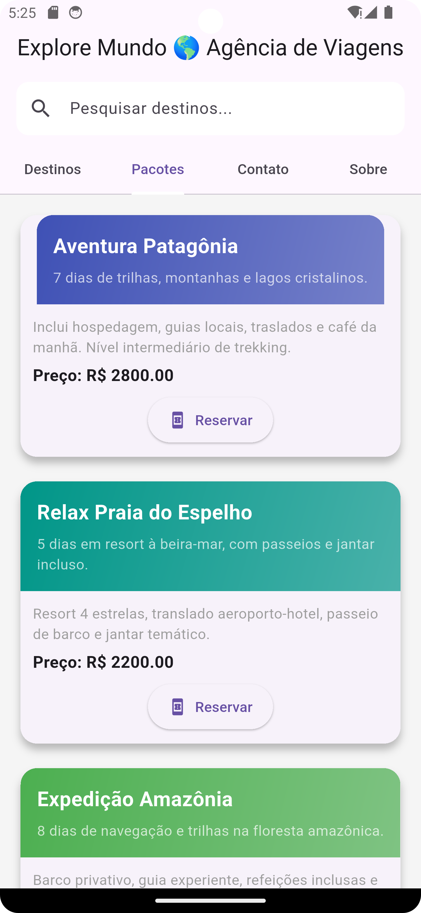
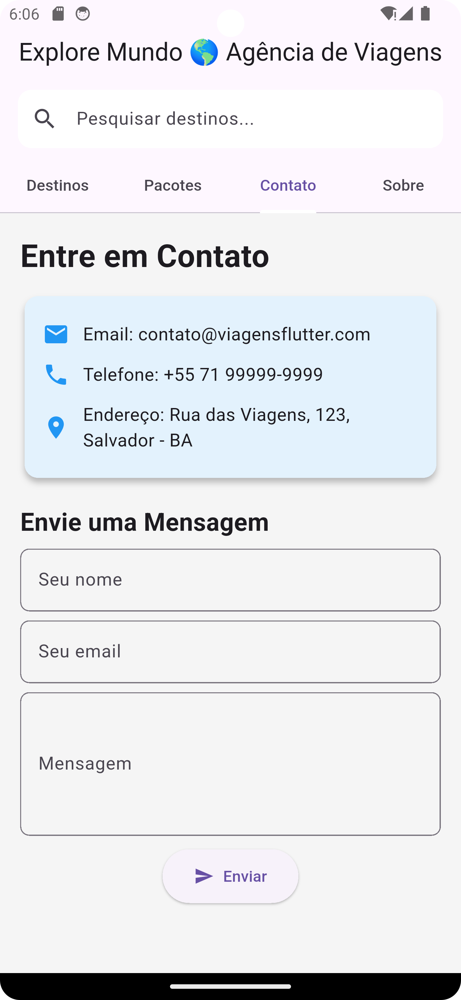

# 🌎 **Explore Mundo – Agência de Viagens**

Aplicativo Flutter que simula uma **agência de turismo moderna e interativa**, desenvolvido como parte do curso de Desenvolvimento Full Stack.
O projeto apresenta destinos turísticos, pacotes de viagem e um sistema de contato com a agência, aplicando conceitos de **UI/UX, Flutter Widgets e interação com recursos nativos**.


---

## 📋 **Sumário**

1. [Visão Geral](#-vis%C3%A3o-geral)
2. [Objetivos](#-objetivos)
3. [Tecnologias e Dependências](#-tecnologias-e-depend%C3%AAncias)
4. [Estrutura do Projeto](#-estrutura-do-projeto)
5. [Arquitetura e Componentes](#-arquitetura-e-componentes)
6. [Interface e Design](#-interface-e-design)
7. [Funcionalidades](#-funcionalidades)
8. [Lógica e Estrutura de Código](#-l%C3%B3gica-e-estrutura-de-c%C3%B3digo)
9. [Pontos Fortes](#-pontos-fortes)
10. [Possíveis Melhorias](#-poss%C3%ADveis-melhorias)
11. [Capturas de Tela](#-capturas-de-tela)
12. [Conclusão](#-conclus%C3%A3o)
13. [Informações do Autor](#-informa%C3%A7%C3%B5es-do-autor)

---

## 🧭 **Visão Geral**

O aplicativo **Explore Mundo** permite ao usuário explorar **principais destinos turísticos**, visualizar **pacotes de viagem**, acessar **informações institucionais** e **entrar em contato** com a agência.

O foco do projeto é aplicar boas práticas de **desenvolvimento mobile com Flutter**, **interface responsiva** e **recursos interativos** como botões dinâmicos e abertura de links externos.

---

## 🎯 **Objetivos**

* Desenvolver um **aplicativo funcional e visualmente atraente**.
* Aplicar **conceitos de Material Design e componentes reativos**.
* Trabalhar com **carrossel de imagens, formulários e navegação por abas**.
* Demonstrar **uso de pacotes externos** (`url_launcher`).
* Publicar o código em **repositório GitHub versionado**.

---

## 🛠 **Tecnologias e Dependências**

**Linguagem:** Dart
**Framework:** Flutter
**Versão mínima recomendada:** Flutter 3.x

**Dependência principal:**

```yaml
dependencies:
  flutter:
    sdk: flutter
  url_launcher: ^6.3.0
```

Utilizada para realizar chamadas, abrir links de mapas e compartilhamentos externos.

---

## 🏗 **Estrutura do Projeto**

```
lib/
 └── main.dart
assets/
 └── images/
      ├── copacabana.jpg
      ├── cataratas.jpg
      ├── chapada.jpg
      ├── floresta.jpg
      ├── montanha.jpg
      └── amazonia.jpg
pubspec.yaml
```

---

## 🧱 **Arquitetura e Componentes**

A aplicação utiliza **`MaterialApp`** e **`StatefulWidget`** para gerenciar o estado das telas.
O conteúdo principal é exibido por meio de **`TabBar`** e **`TabBarView`**, separando as seguintes seções:

| Aba              | Descrição                                                            | Recursos                                   |
| ---------------- | -------------------------------------------------------------------- | ------------------------------------------ |
| 🏖️ **Destinos** | Exibe carrossel de destinos com imagens, descrições e ações rápidas. | `ListView`, `PageView`, botões dinâmicos.  |
| 💼 **Pacotes**   | Lista pacotes de viagem com preços e opções de reserva.              | `Card`, `ElevatedButton.icon`, `Gradient`. |
| ✉️ **Contato**   | Formulário para envio de mensagem e informações de contato.          | `TextField`, `SnackBar`.                   |
| 🏢 **Sobre**     | Mostra dados institucionais e história da agência.                   | `Column`, `Text.rich`, `Card`.             |

---

## 🎨 **Interface e Design**

O design segue o padrão **Material Design**, utilizando tons de azul e cinza-claro.
Todos os elementos são **responsivos**, com imagens otimizadas para diferentes tamanhos de tela.

**Principais Widgets:**

* `Scaffold`, `AppBar`, `TabBar`, `TabBarView`

* `ListView`, `Card`, `Container`, `Image.asset`

* `ElevatedButton`, `IconButton`, `SnackBar`, `TextField`

**Paleta de Cores:**

* Primária: `Colors.blue`
* Secundária: `Colors.grey[100]`
* Texto: `Colors.black87`

---

## ⚙️ **Funcionalidades**

✅ Carrossel automático com destinos turísticos.
✅ Listagem de pacotes com gradiente e botão “Reservar”.
✅ Formulário de contato com validação simples e feedback visual.
✅ Abertura de links externos via `url_launcher`.
✅ Interface totalmente responsiva e intuitiva.

---

## 🧠 **Lógica e Estrutura de Código**

* Os dados de destinos e pacotes são armazenados em **listas de mapas** (`List<Map<String, dynamic>>`).
* A navegação entre as seções é feita com **`TabController`**.
* As funções auxiliares `_buildButtonColumn()`, `_buildPacoteCardDinamico()` e `_buildTextField()` garantem **reutilização de código e consistência visual**.
* O app utiliza **setState()** para atualizar o estado de componentes interativos.

---

## 💪 **Pontos Fortes**

* Código limpo e comentado.
* Boa organização visual e fluidez na navegação.
* Aplicação de componentes avançados do Flutter.
* Design moderno e coerente com a proposta de turismo.

---

## 🔧 **Possíveis Melhorias**

* Implementar **modo escuro (Dark Mode)**.
* Adicionar **validação completa** no formulário de contato.
* Modularizar o projeto em múltiplos arquivos (`screens`, `widgets`, `models`).
* Integrar com uma **API REST** para carregar destinos reais.

---

## 📸 **Capturas de Tela**

*(Adicione suas imagens aqui após gerar os prints do app)*

```markdown



```

---

## 🧾 **Conclusão**

O projeto **Explore Mundo – Agência de Viagens** demonstrou o domínio dos conceitos fundamentais do **Flutter**, aplicando boas práticas de design, navegação e interação com APIs nativas.

A aplicação apresenta potencial para expansão, podendo evoluir com autenticação de usuários, integração com banco de dados e reservas online.

---

## 👨‍💻 **Informações do Autor**

**Nome:** Eliton Rodrigues de Oliveira

**Repositório GitHub:** [https://github.com/Elitonr65/Explore_Mundo_](#)

---

🌀 *Desenvolvido com Flutter e muito café ☕ por Eliton Rodrigues.*
